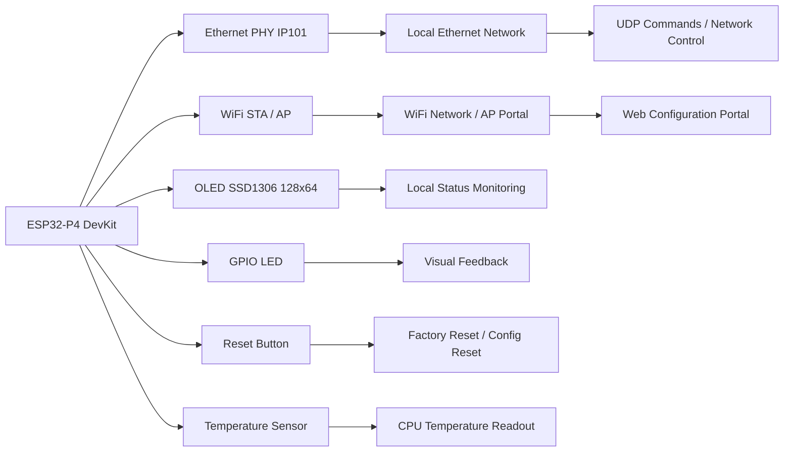
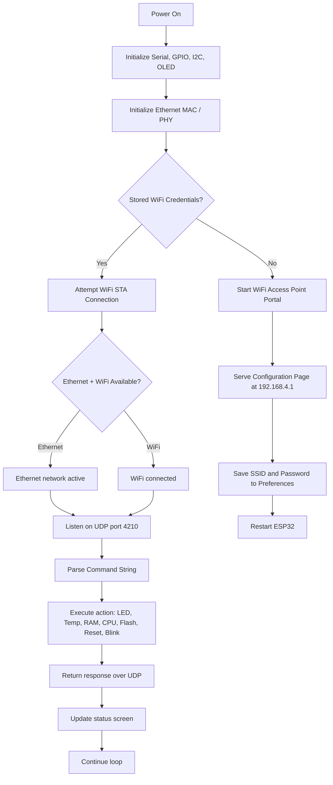
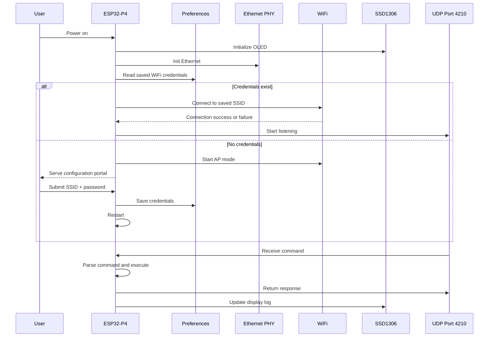

# ESP32 Wi‑Fi + Ethernet Control Node

A robust ESP32-P4 firmware designed to operate as a dual-interface network node with automatic Ethernet priority, Wi‑Fi configuration portal, OLED status display, and UDP command control. This project is implemented in a single Arduino sketch (`wifi_Eth.ino`) and is intended for rapid deployment in embedded automation, diagnostics, and local network control scenarios.

<p align="center">
  
  
  
  
</p>

## Overview

This firmware turns the ESP32-P4 Dev Kit into an intelligent edge node that:

- Connects to Ethernet when available and prefers it over Wi‑Fi
- Falls back to a Wi‑Fi access point configuration portal if no stored credentials are found
- Stores Wi‑Fi credentials in non-volatile memory using Preferences
- Displays system state on a 128x64 OLED module
- Exposes a lightweight UDP control interface for commands such as LED control, temperature reads, chip diagnostics, and blink patterns
- Provides a web page for configuration through a captive setup portal

This project is especially useful for:

- Industrial or home automation nodes
- Network monitoring and diagnostic endpoints
- Embedded lab and prototype systems
- Low-cost control gateways with Ethernet and wireless fallback

---

## System Architecture

### High-Level Block Diagram



### Functional Data Flow



---

## Hardware Concept and Wiring

### Simplified Wiring Diagram

```text
                               +--------------------------------------+
                               |          ESP32-P4 DevKit            |
                               |                                      |
                 +-----------------+             +-------------------+         
                 |  ETH PHY IP101 |<---------->| RMII / MDC / MDIO |         
                 |  (Address 1)   |             |  PHY Control Pins |         
                 +-----------------+             +-------------------+         
                              |                                      |
                              |  Ethernet                               |
                              +--------------------------------------+
                                       |
                                       v
                              +------------------+
                              |  Ethernet Cable  |
                              +------------------+

                               +-------------------------+
                               |   SSD1306 OLED 128x64  |
                               |   SDA = GPIO 7         |
                               |   SCL = GPIO 8         |
                               +-------------------------+

                               +-------------------------+
                               |   LED                   |
                               |   GPIO 1                |
                               +-------------------------+

                               +-------------------------+
                               |   Reset Button          |
                               |   GPIO 2 (pull-up)      |
                               +-------------------------+
```

### Pin Mapping

| Function | ESP32-P4 Pin | Notes |
| --- | --- | --- |
| OLED SDA | GPIO 7 | I2C data |
| OLED SCL | GPIO 8 | I2C clock |
| LED | GPIO 1 | User status LED |
| Reset Button | GPIO 2 | Active LOW |
| ETH MDC | GPIO 31 | PHY management clock |
| ETH MDIO | GPIO 52 | PHY management IO |
| ETH PHY Power/Reset | GPIO 51 | PHY power control |
| ETH PHY Type | IP101 | Ethernet PHY selected in code |
| ETH Clock Mode | External clock input | RMII external source |

### Ethernet Configuration Used

```cpp
#define ETH_PHY_TYPE   ETH_PHY_IP101
#define ETH_PHY_ADDR   1
#define ETH_PHY_MDC    31
#define ETH_PHY_MDIO   52
#define ETH_PHY_POWER  51
#define ETH_CLK_MODE   EMAC_CLK_EXT_IN
```

This configuration is tuned for the ESP32-P4 DevKit and the IP101 PHY used on the board or attached Ethernet interface.

---

## Software Features

### 1. Ethernet Priority and Wi‑Fi fallback

The firmware initializes Ethernet first and configures event handlers for:

- `ARDUINO_EVENT_ETH_START`
- `ARDUINO_EVENT_ETH_CONNECTED`
- `ARDUINO_EVENT_ETH_GOT_IP`
- `ARDUINO_EVENT_ETH_DISCONNECTED`
- `ARDUINO_EVENT_ETH_STOP`

This ensures Ethernet is treated as the primary network path when available, while Wi‑Fi remains available as a fallback or configuration path.

### 2. Web configuration portal

If no saved Wi‑Fi SSID/password are found, the board starts an AP named:

- `ESP32_P4_CONFIG`

The local portal is served at:

- `http://192.168.4.1`

The user submits SSID and password through a small HTML form, which is then stored in non-volatile memory using the `Preferences` library.

### 3. OLED status display

A 128x64 SSD1306 display provides real-time operational feedback including:

- OLED initialized successfully
- Ethernet started / connected
- IP address assigned
- Wi‑Fi connection attempts
- Wi‑Fi portal active
- Command responses
- Sensor outputs

### 4. UDP command interface

The sketch listens on UDP port `4210` and processes commands sent by a remote host. This allows the node to be controlled or queried without needing a serial terminal or a full web API.

### 5. Diagnostics and monitoring

The firmware exposes information including:

- CPU temperature
- Free RAM and heap state
- Flash memory characteristics
- Uptime
- Reset reason
- IP / gateway / mask / RSSI information
- Device MAC address
- CPU model and core count

---

## Boot and Operation Sequence



---

## Configuration Flow

### Wi‑Fi Setup Process

1. Power on the board.
2. If no stored Wi‑Fi credentials are present, the ESP32 creates an access point.
3. Connect to `ESP32_P4_CONFIG`.
4. Open the web page at `192.168.4.1`.
5. Enter the target SSID and password.
6. The board saves credentials and restarts.
7. On restart, it attempts to connect using the saved network settings.

### Factory Reset

The device supports reset behavior through the hardware button and command procedures:

- Press the reset button to trigger configuration clear
- Use `RESET_WIFI` command via UDP to clear stored Wi‑Fi settings and restart

---

## UDP Command Reference

Commands are received as strings on UDP port `4210`.

| Command | Description |
| --- | --- |
| `RESET_WIFI` | Clear saved Wi‑Fi configuration and restart |
| `LED_ON` | Force user LED ON |
| `LED_OFF` | Force user LED OFF |
| `TEMP` | Read internal CPU temperature |
| `CPU` | Return CPU model, revision, cores, CPU frequency, heap |
| `RAM` | Return heap and memory statistics |
| `FLASH` | Return flash size, speed, sketch size, available space |
| `INIT` | Return reset reason |
| `UPTIME` | Return uptime in milliseconds |
| `MAC` | Return Wi‑Fi MAC address |
| `NET_INFO` | Return IP, gateway, mask, SSID, RSSI |
| `LED_PISCA:x:y` | Blink the LED `x` times with `y` ms delay |
| `LED_BLINK:n` | Toggle LED continuously at interval `n` ms |

### Example UDP Commands

```text
LED_ON
LED_OFF
TEMP
CPU
RAM
FLASH
UPTIME
MAC
NET_INFO
LED_PISCA:5:250
LED_BLINK:500
```

---

## Key Code Areas

This project is intentionally concentrated in a single file:

- `wifi_Eth.ino` — main firmware, networking, Wi‑Fi portal, OLED logic, UDP command parser, and diagnostics

### Main firmware responsibilities

- `setup()` — board initialization, OLED, Ethernet, Wi‑Fi startup
- `loop()` — UDP parsing, reset handling, blinking LED logic
- `conectarWifi()` — Wi‑Fi connection attempt with stored SSID/password
- `iniciarPortal()` — AP mode and HTTP configuration server
- `salvarWifi()` — save network credentials to flash
- `executa_comando()` — parse and handle UDP commands
- `lerTemperaturaP4()` — read temperature sensor data
- `onNetworkEvent()` — Ethernet lifecycle event management

---

## Project Structure

```text
esp32_wifi_eth_P4/
├── README.md
├── wifi_Eth.ino
└── .gitignore
```

---

## Quick Start Guide

### Required Libraries

Install the following in the Arduino IDE / PlatformIO environment:

- `WiFi.h`
- `WebServer.h`
- `Preferences.h`
- `WiFiUdp.h`
- `Wire.h`
- `Adafruit_GFX.h`
- `Adafruit_SSD1306.h`
- ESP32 board support package for the P4 platform

### Board Setup

1. Select the ESP32-P4 board in Arduino IDE.
2. Connect the OLED to GPIO 7/8 (SDA/SCL).
3. Connect the Ethernet PHY lines as configured in the code.
4. Connect the user LED to GPIO 1 and reset button to GPIO 2.
5. Compile and upload `wifi_Eth.ino`.
6. Watch the serial monitor and OLED activity.

### Serial Monitor Expectations

You should see messages such as:

```text
OLED Pronto!
Interface Ethernet iniciada.
Cabo Ethernet conectado!
IP obtido via DHCP: 192.168.1.25
Wifi Conectado!
```

Or if there is no saved Wi‑Fi profile:

```text
Portal Ativo!
Wifi: ESP32_P4_CONFIG
IP: 192.168.4.1
```

---

## Troubleshooting

### Ethernet does not initialize

- Verify that the PHY address matches the network board design
- Check `ETH_PHY_MDC`, `ETH_PHY_MDIO`, and `ETH_PHY_POWER`
- Confirm that `ETH_CLK_MODE` matches the board hardware configuration
- Ensure the Ethernet PHY is receiving proper power and reset timing

### OLED does not show text

- Check the I2C wiring on GPIO 7 and GPIO 8
- Verify the display address matches `0x3C`
- Ensure the SDA/SCL pull-ups are present on the board or per design

### Wi‑Fi portal does not appear

- Confirm the board is booting with no stored SSID
- Check the serial monitor for AP mode initialization
- Ensure the device is connecting to `ESP32_P4_CONFIG`

### UDP commands are not responding

- Confirm the sender is sending to the correct IP and UDP port `4210`
- Validate that the board is connected to the network and has an IP address
- Check for firewall or host restrictions on the receiving PC or gateway device

---

## Use Cases

This firmware is well suited for:

- Smart building infrastructure nodes
- Remote control and telemetry gateways
- Ethernet-first industrial controllers
- Maintenance and diagnostics endpoints
- Wi‑Fi configuration with Ethernet priority fallback

---

## Notes

- The code stores configuration in non-volatile memory using `Preferences` for persistent Wi‑Fi recovery.
- The project is intentionally compact, keeping logic in a single `.ino` file for fast prototyping and deployment.
- Ethernet is preferred over Wi‑Fi as the active network path, which is useful for stability in wired environments.

---

## Summary

The ESP32 Wi‑Fi + Ethernet Control Node is a reliable, feature-rich foundation for building embedded network devices that require resilient connectivity, local configuration, sensor reading, and command-based control. It combines the flexibility of Wi‑Fi configuration with the stability of Ethernet priority, while exposing a compact and practical control interface via UDP.

If you want, I can also generate a second version of the README in Portuguese (Brazilian style), or create a more visually polished GitHub-style landing page with badges, architecture diagrams, and a product-style presentation.

